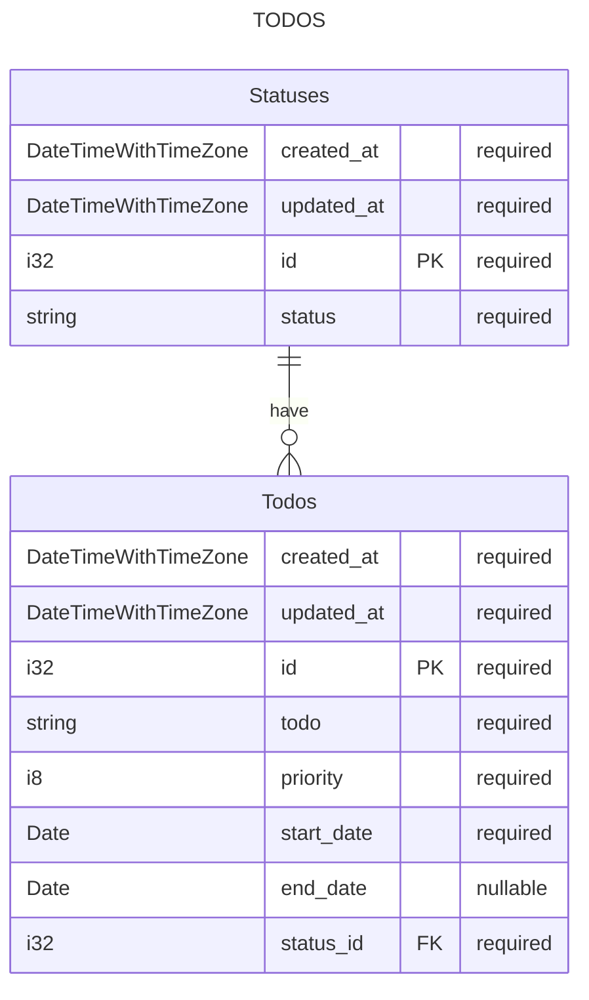

# Documentation

## Ivy Lee Method

1. Write down the 6 most important tasks for the next day every night.
2. Arrange the tasks in order of importance, from highest to lowest.
3. Focus on the first task and do not switch tasks until you finish it.
4. Consider whether to move unfinished tasks to tomorrow's list.
5. Repeat this every day and you will see the difference.

---

## Todos ER Diagram



## SQL definitions

```text
Statuses
  status varchar(255) not null

Tasks
  date date not null
  task varchar(255) not null
  priority smallint not null (1 to 6)
  start_date date not null
  end_date date null
  status_id fk status not null references Statuses
```

## Loco commands

```bash
cargo loco generate scaffold status \
    status:string \
    --htmx

cargo loco generate scaffold todo \
    todo:string! \
    priority:tiny_int! \
    start_date:date! \
    end_date:date \
    status:references \
    --htmx

cargo loco db migrate

cargo test
```

---

## Application TODOS

- In /todos route, order by priority ascending
- In /todos route, add status_id and status
- In /todos/{id} route, add status_id and status
- In /todos/{id}/edit, add end_date control
- In /todos/{id}/edit, add status_id control (listbox)
- In /todos/new, remove end_date control
- In /todos/new, make start_date defaulted to today's date.
- In /todos/new, make status_id defaulted to 1 - TO DO status.
